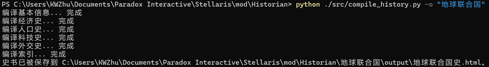

以下所述操作中可能会遇到网络问题，需要挂上梯子。
# 一、安装
## 1. 安装 Git
Git 是一个版本控制系统，可以方便地管理开发中的项目，这里用于获取模组文件。

点击 [git-for-windows](https://github.com/git-for-windows/git/releases/download/v2.41.0.windows.3/Git-2.41.0.3-64-bit.exe) 以下载 Git 安装程序，运行该程序以安装 Git，各选项可保持默认。

## 2. 获取模组
在 Stellaris 模组文件夹（通常为 `C:\Users\{用户名}\Documents\Paradox Interactive\Stellaris\mod`）中，打开 Powershell 终端（在右键菜单中，若为 Windows 10 系统需要按 `Shift` + 右击），运行以下命令

```powershell
git clone https://github.com/Kaiwen-Zhu/Historian.git
Write-Output ("version=`"0.1.1`"`ntags={`n    `"Utilities`"`n}`nname=`"Historian`"`nsupported_version=`"3.8.*`"`npath=`"$pwd\Historian`"" -replace "\\","/") | Out-File -FilePath Historian.mod -Encoding utf8
```
成功后，终端内容如下图所示。

此时模组文件夹中应存在 `Historian` 文件夹和 `Historian.mod` 文件，如下图所示。


## 3. 搭建 Python 环境
### 3.1 安装 Python
点击 [Python 3.11.4](https://www.python.org/ftp/python/3.11.4/python-3.11.4-amd64.exe) 以下载 Python 安装程序（更多版本见 [Python Downloads](https://www.python.org/downloads/)），运行该程序以安装 Python 解释器，安装时注意勾选 "Add python.exe to PATH"（如下图所示），其余选项可保持默认。


### 3.2 安装所需的包
在 `Historian` 文件夹下的 Powershell 终端运行如下命令。
```sh
pip install -r requirements.txt
```
成功后，终端内容如下图所示。


## 4. 获取更新
在 `Historian` 文件夹下的 Powershell 终端运行如下命令。
```sh
git pull
```
成功后，若模组有更新，终端内容如下图所示。

若无更新，终端内容如下图所示。


# 二、使用
使用本模组需要运行两个 Python 脚本（运行方法稍后详细说明）：
+ **每次退出游戏后，运行 `src` 文件夹中的 `extract_history.py`**，这会从游戏日志中提取数据并写入结构化的数据文件；
+ **想要生成史书时，运行 `src` 文件夹中的 `compile_history.py`**，这会从 `extract_history.py` 生成的数据文件中读取数据并编译出 HTML 文档。
  
生成的数据文件和 HTML 文档会被保存到 `Historian` 文件夹下的一个单独的文件夹中，该文件夹的名称作为一个参数需要在运行脚本的时候指定（若不指定则为默认值 `MemoryGrain`）。因此，**玩家的每个国家须对应一个独有的文件夹**，即，**对于一个国家，假设希望将其相关文件保存在名为 `地球联合国` 的文件夹中，则**
+ **第一次运行 `extract_history.py` 前，应保证 `Historian` 文件夹下没有名为 `地球联合国` 的文件夹；**
+ **文件夹 `地球联合国` 将会在第一次运行 `extract_history.py` 时被自动创建，结档前，不可随意删改或移动该文件夹中的文件；**
+ **每次为该国家运行脚本时，该参数都应为 `地球联合国`。**

生成史书后，点击 `地球联合国/output/地球联合国史.html` 查看（假设国名为“地球联合国”）。**若希望将生成的史书移至别处，需要将 `output` 这一文件夹作为整体移动，不可单独移出 `地球联合国史.html` 文件。**

以下介绍运行脚本的方法。
#### 运行 `extract_history.py`
在 `Historian` 文件夹下的 Powershell 终端运行如下命令。
```sh
python ./src/extract_history.py -o "地球联合国"
```
生成的数据文件将被存储到 `./地球联合国/data`。

成功后，终端内容如下图所示。

#### 运行 `compile_history.py`
在 `Historian` 文件夹下的 Powershell 终端运行如下命令。
```sh
python ./src/compile_history.py -o "地球联合国"
```
生成的史书将被存储到 `./地球联合国/output`。

成功后，终端内容如下图所示。


提示：在终端中，可按 `↑`、`↓` 键恢复历史命令以避免重复键入。

**注意：如果玩家某次退出游戏后没有运行 `extract_history.py`，那么其信息会在玩家再次进入游戏时 _丢失_，因为每次进入游戏后游戏日志都会被覆盖。**
